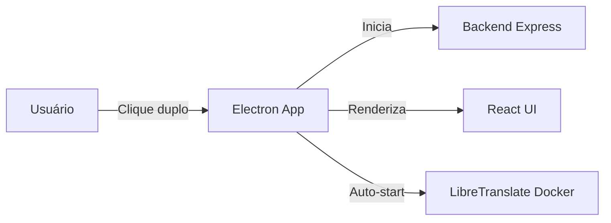
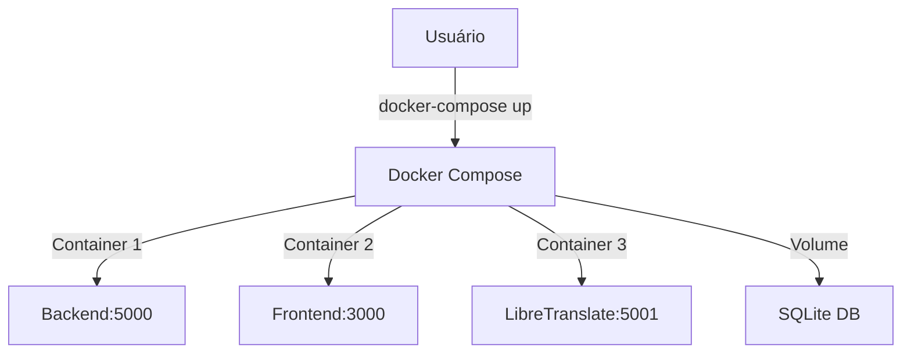
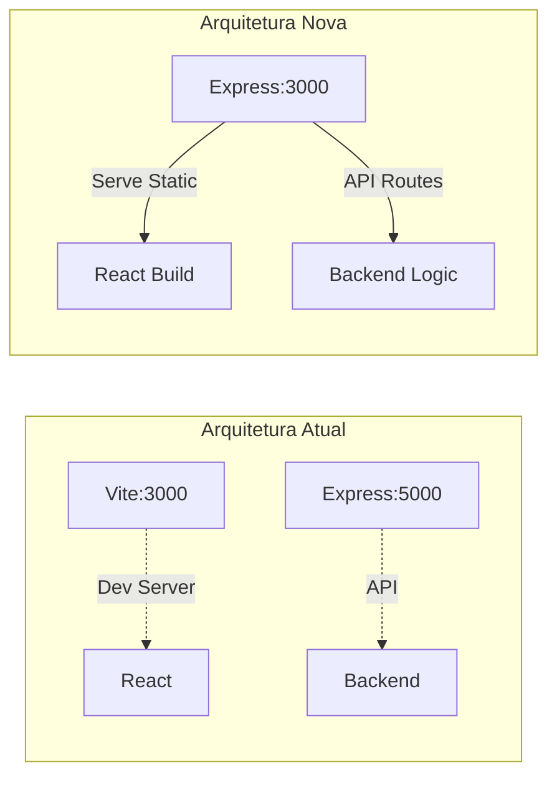

# Plano: Simplificar Execução + Auto-Start LibreTranslate

## Problema Atual

A aplicação é difícil de executar devido a:

1. Necessidade de rodar backend e frontend separadamente
2. Problemas com `.bat` files no Windows (PowerShell encoding)
3. Comandos complexos e múltiplas janelas
4. LibreTranslate aparece como "Stopped" e requer inicialização manual

## Solução 1: Aplicação Desktop com Electron (Mais Fácil)

### Objetivo

Criar um executável único (`.exe` para Windows, `.AppImage` para Linux) que o usuário simplesmente clica duas vezes para abrir.

### Arquitetura



### Implementação

**Arquivos a criar:**

- [`electron/main.js`](electron/main.js) - Entry point do Electron, gerencia janela e processos
- [`electron/preload.js`](electron/preload.js) - Bridge segura entre Electron e React
- [`electron/package.json`](electron/package.json) - Configuração e build scripts
- [`electron/icon.ico`](electron/icon.ico) / [`electron/icon.png`](electron/icon.png) - Ícones da aplicação

**Funcionalidades:**

1. **Auto-start Backend**: Electron inicia `backend/server.js` automaticamente em processo filho
2. **Auto-start LibreTranslate**: Verifica se Docker está disponível e inicia container automaticamente
3. **UI Integrada**: Carrega React frontend em janela Electron (sem navegador externo)
4. **Tray Icon**: Ícone na bandeja do sistema para minimizar/restaurar
5. **Auto-update**: Suporte para atualizações automáticas (opcional)
6. **Single Instance**: Previne múltiplas instâncias da aplicação

**Build process:**

```bash
# Desenvolvimento
npm run electron:dev

# Build para Windows
npm run electron:build:win  # Gera .exe

# Build para Linux
npm run electron:build:linux  # Gera .AppImage
```

**Modificações necessárias:**

- [`package.json`](package.json): Adicionar scripts Electron e dependências (`electron`, `electron-builder`)
- [`frontend/vite.config.js`](frontend/vite.config.js): Configurar build para Electron
- [`backend/server.js`](backend/server.js): Adicionar flag para modo Electron (sem abrir navegador)

---

## Solução 2: Docker Compose (Cross-Platform)

### Objetivo

Um único comando `docker-compose up` que funciona identicamente em Windows, Linux e Mac.

### Arquitetura



### Implementação

**Arquivos a criar:**

- [`Dockerfile.backend`](Dockerfile.backend) - Imagem do backend Node.js
- [`Dockerfile.frontend`](Dockerfile.frontend) - Imagem do frontend React
- [`docker-compose.yml`](docker-compose.yml) - Orquestração dos 3 serviços
- [`.dockerignore`](.dockerignore) - Excluir node_modules, etc.

**docker-compose.yml estrutura:**

```yaml
services:
  backend:
    build: ./backend
    ports: ["5000:5000"]
    volumes: ["./backend/database:/app/database"]
    environment:
                           - LIBRETRANSLATE_URL=http://libretranslate:5000
    depends_on: [libretranslate]
  
  frontend:
    build: ./frontend
    ports: ["3000:3000"]
    environment:
                           - VITE_API_URL=http://localhost:5000
    depends_on: [backend]
  
  libretranslate:
    image: libretranslate/libretranslate
    ports: ["5001:5000"]
```

**Comandos simplificados:**

```bash
# Iniciar tudo
docker-compose up

# Parar tudo
docker-compose down

# Rebuild após mudanças
docker-compose up --build
```

**Documentação:**

- Atualizar [`README.md`](README.md) com seção Docker
- Criar [`DOCKER_GUIDE.md`](DOCKER_GUIDE.md) com instruções detalhadas

---

## Solução 3: Servidor Único (Simplificar Arquitetura)

### Objetivo

Unificar backend e frontend em um único processo Node.js, eliminando a necessidade de dois servidores.

### Arquitetura Atual vs Nova



### Implementação

**Modificações principais:**

1. **[`backend/server.js`](backend/server.js)**:

                        - Adicionar `express.static()` para servir build do frontend
                        - Mudar porta padrão para 3000
                        - Adicionar fallback para SPA routing

2. **[`package.json`](package.json)** (root):

                        - Novo script `start`: Build frontend + start backend
                        - Script `dev`: Modo desenvolvimento (Vite proxy)

3. **[`frontend/vite.config.js`](frontend/vite.config.js)**:

                        - Configurar proxy para `/api` → `http://localhost:5000` em dev
                        - Build output para `../backend/public`

**Comandos finais:**

```bash
# Produção (um comando)
npm start

# Desenvolvimento (hot reload)
npm run dev
```

**Vantagens:**

- Um único processo para gerenciar
- Uma única porta (3000)
- Mais simples de fazer deploy
- Menos confusão para usuários

---

## Correção: Auto-Start LibreTranslate

### Problema

O painel "Local Translation" sempre mostra "🔴 Stopped" ao abrir a aplicação, exigindo clique manual em "Start".

### Solução

Implementar auto-start inteligente do LibreTranslate quando:

1. Usuário abre a aplicação
2. Docker está disponível
3. LibreTranslate não está rodando

### Implementação

**1. Backend: Auto-start na inicialização**

Modificar [`backend/server.js`](backend/server.js):

```javascript
// Após inicialização do servidor
import libreTranslateManager from './services/libreTranslateManager.js';

async function autoStartLibreTranslate() {
  const dockerAvailable = await libreTranslateManager.isDockerAvailable();
  if (!dockerAvailable) return;
  
  const health = await libreTranslateManager.healthCheck();
  if (health.running) return; // Já está rodando
  
  console.log('🐳 Auto-starting LibreTranslate...');
  const result = await libreTranslateManager.startLibreTranslate();
  
  if (result.success) {
    console.log('✅ LibreTranslate started automatically');
  } else {
    console.log('⚠️ Failed to auto-start LibreTranslate:', result.message);
  }
}

// Chamar após servidor estar pronto
server.listen(PORT, async () => {
  console.log(`Backend running on port ${PORT}`);
  await autoStartLibreTranslate(); // Auto-start
});
```

**2. Frontend: Indicador de inicialização**

Modificar [`frontend/src/components/LocalTranslationPanel.jsx`](frontend/src/components/LocalTranslationPanel.jsx):

```javascript
// Adicionar estado para auto-start
const [autoStarting, setAutoStarting] = useState(false);

// Detectar quando backend está auto-iniciando
useEffect(() => {
  // Polling mais frequente nos primeiros 30s
  const quickInterval = setInterval(checkStatus, 2000);
  setTimeout(() => clearInterval(quickInterval), 30000);
  
  return () => clearInterval(quickInterval);
}, []);

// Atualizar UI
{autoStarting && (
  <div className="auto-start-notice">
    ⏳ Auto-starting LibreTranslate... This may take 10-30 seconds.
  </div>
)}
```

**3. Configuração persistente**

Adicionar setting em [`backend/models/Settings.js`](backend/models/Settings.js):

- `autoStartLibreTranslate` (boolean, default: true)

Adicionar toggle na UI do [`LocalTranslationPanel`](frontend/src/components/LocalTranslationPanel.jsx):

```javascript
<label>
  <input 
    type="checkbox" 
    checked={autoStart}
    onChange={handleToggleAutoStart}
  />
  Auto-start LibreTranslate on app launch
</label>
```

**4. Melhorias no [`libreTranslateManager.js`](backend/services/libreTranslateManager.js)**:

- Adicionar retry logic (tentar 3x se falhar)
- Melhorar detecção de container existente mas parado (restart ao invés de criar novo)
- Adicionar timeout para pull da imagem Docker (primeira vez pode demorar)

---

## Ordem de Implementação

### Fase 1: Correção Auto-Start (Prioridade Alta)

1. Implementar auto-start no `backend/server.js`
2. Melhorar `libreTranslateManager.js` com retry logic
3. Atualizar UI do `LocalTranslationPanel.jsx`
4. Adicionar configuração persistente
5. Testar em Windows e Linux

### Fase 2: Servidor Único (Rápido de implementar)

1. Modificar `backend/server.js` para servir static files
2. Atualizar scripts no `package.json`
3. Configurar Vite proxy
4. Testar build e produção

### Fase 3: Docker Compose (Médio esforço)

1. Criar Dockerfiles
2. Criar docker-compose.yml
3. Testar em Windows/Linux
4. Documentar

### Fase 4: Electron Desktop (Maior esforço)

1. Setup Electron boilerplate
2. Integrar backend/frontend
3. Configurar electron-builder
4. Gerar executáveis
5. Testar instalação

---

## Resultados Esperados

### Para o Usuário Final

**Antes:**

1. Abrir cmd
2. Colar comando longo
3. Esperar backend iniciar
4. Esperar frontend iniciar
5. Abrir navegador manualmente
6. Clicar em "Start LibreTranslate"
7. Esperar iniciar
8. Finalmente usar a aplicação

**Depois (Electron):**

1. Clique duplo no ícone
2. Aplicação abre pronta para usar (tudo auto-start)

**Depois (Docker):**

1. `docker-compose up`
2. Abrir navegador em localhost:3000

**Depois (Servidor Único):**

1. `npm start`
2. Abrir navegador em localhost:3000

### Compatibilidade

| Solução | Windows | Linux | Mac | Dificuldade | Melhor Para |

|---------|---------|-------|-----|-------------|-------------|

| Electron | ✅ .exe | ✅ .AppImage | ✅ .dmg | Alta | Usuários não-técnicos |

| Docker | ✅ | ✅ | ✅ | Média | Desenvolvedores |

| Servidor Único | ✅ | ✅ | ✅ | Baixa | Todos |

| Auto-Start Fix | ✅ | ✅ | ✅ | Baixa | Todos |

---

## Arquivos Principais a Modificar/Criar

### Criar (Electron)

- `electron/main.js`
- `electron/preload.js`
- `electron/package.json`
- `electron/icon.ico` / `icon.png`

### Criar (Docker)

- `Dockerfile.backend`
- `Dockerfile.frontend`
- `docker-compose.yml`
- `.dockerignore`
- `DOCKER_GUIDE.md`

### Modificar (Todas as soluções)

- [`backend/server.js`](backend/server.js) - Auto-start LibreTranslate + servir static files
- [`backend/services/libreTranslateManager.js`](backend/services/libreTranslateManager.js) - Retry logic
- [`frontend/src/components/LocalTranslationPanel.jsx`](frontend/src/components/LocalTranslationPanel.jsx) - UI auto-start
- [`package.json`](package.json) - Novos scripts
- [`README.md`](README.md) - Documentação atualizada
- [`QUICK_START.md`](QUICK_START.md) - Instruções simplificadas

---

## Notas Técnicas

### Electron Considerations

- Usar `electron-builder` para builds multiplataforma
- Tamanho do executável: ~150-200MB (inclui Chromium)
- Code signing necessário para evitar warnings no Windows/Mac
- Auto-update via `electron-updater` (opcional)

### Docker Considerations

- Primeira execução demora (pull de imagens)
- Requer Docker Desktop no Windows/Mac
- Volumes para persistir database
- Health checks para garantir ordem de inicialização

### Servidor Único Considerations

- Build do frontend antes de produção
- Cache de static files
- Fallback para SPA routing (catch-all route)
- Environment variables para configuração

### Auto-Start Considerations

- Verificar se container já existe mas está parado (restart vs create)
- Timeout adequado para pull da imagem (primeira vez)
- Feedback visual durante inicialização
- Graceful degradation se Docker não disponível